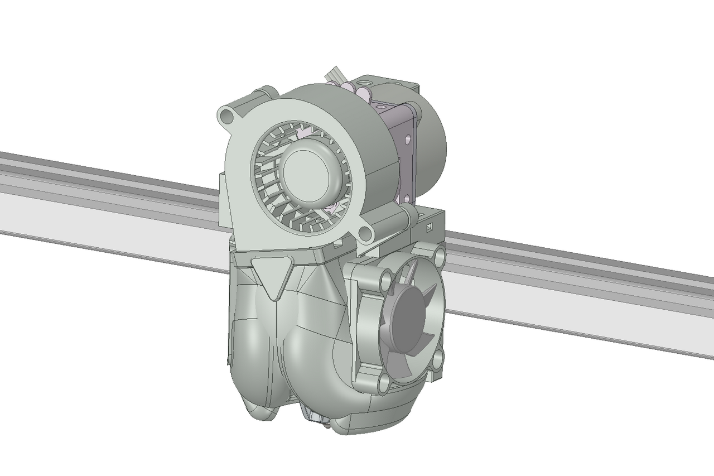
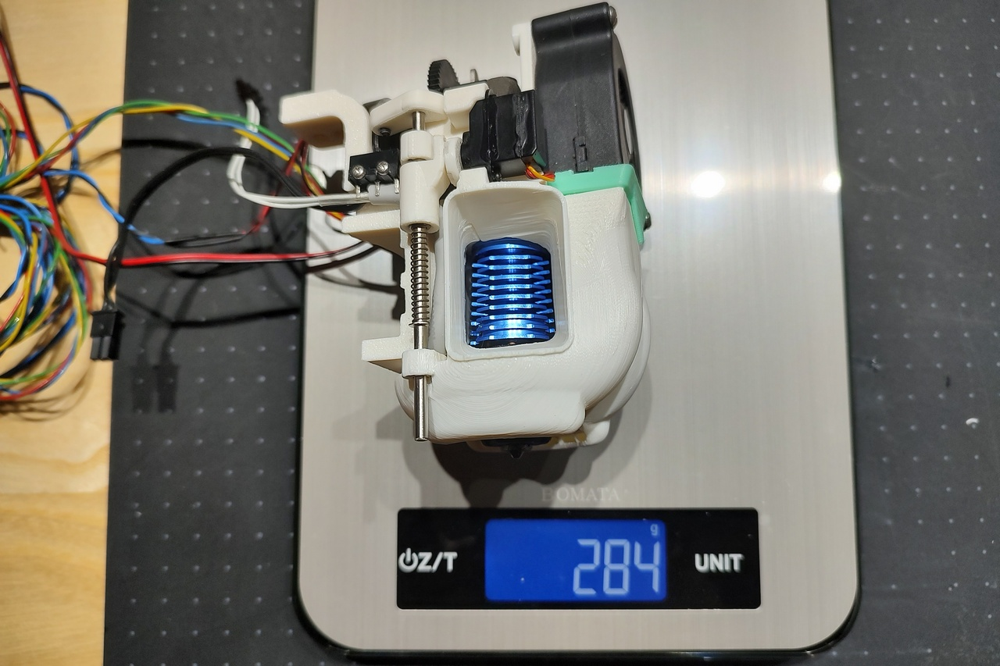
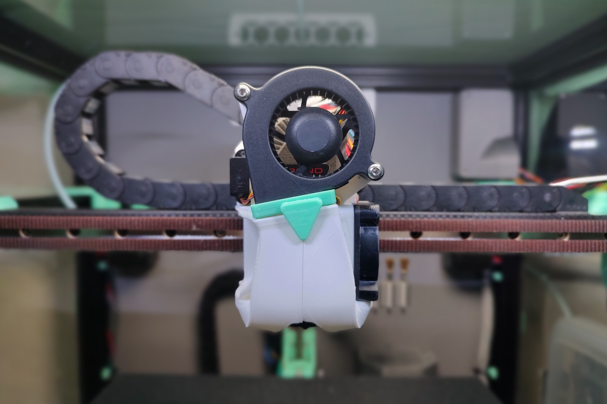

# Strix Tool Head
 
 
 

# Caution
This toolhead is still under development and has not yet been tested for stability.   
I am trying to design a better toolhead, but something could go wrong and your 3D printer could break.

# Features
- Short distance from the linear rail to the nozzle.
- Light weight. (290g or less)
- Optimized airflow.
- 5020 blower fan. (parts cooling)
- Built-in retractable Z-probe.
- Silent

# Parts Printing
- Layer height 0.2mm, Extrusion width 0.4mm, Wall count 4, Top/Bottom layers 8, Infill 40%.
- Lightness and strength are prioritized over ease of printing, so most parts require support.
- Select ServoHorn2.2gA(B).stl and ServoHorn2gA(B).stl according to your servo motor
- Servo horns A and B differ in thickness by 0.2 mm. Select the one that fits.
- Body parts(BodyLeft.stl, BodyRight.stl) are difficult to print, so some are pre-supported. Choose your preference.

# BOM
- M2.5 x 6mm BHCS x4 (for Rapido hotend)
- M3 x 8mm BHCS x4 (for linear rail)
- M3 x 10mm BHCS x7
- M3 x 25mm BHCS x2
- M3 x 35mm BHCS x2
- M2 x 10mm Self-Tapping Screw x2
- M1.7 x 3mm Flat Head Screw x1 (for servo horn)
- M1.7 x 5mm x2 (for servo mount)
- M3 x 6mm Set Screw x1
- M3 x 4mm Insert Nut x12
- 3mm(ID) x 5mm(OD) x 5mm(L) Sleeve Bearing(Oilless Bushings) x4
- 3mm(D) x 80-83mm(L) Stainless Steel Shaft x1
- 0.8mm(D) x 6mm(L) Piano wire x1 
- 2mm(ID) E-Clip x2
- 3mm(ID) x 25mm(L) Compression Spring x1
- 26mm(L) PTFE Tube x1
- 7mm x 20mm x 0.5mm Carbon fiber plate x1 (Option)
- Micro Switch (OMRON D2F-01F Low operating force 0.74 N) x1
- Servo Motor 2.2g(Rrlandoo AS0022) or 2g(Dspower DSM005) x1
- 5020 Blower Fan (Sunon GB1205PKV3-8AY or GDSTIME GDB5030) x1
- 4010 Axial Fan x1
- Phaetus Rapido HF x1
- Bondtech LGX Lite x1
